# N_GACL: Real-Time RGB Proxy Vegetation Indexing and Texture Analysis for UAV and Handheld Crop Imagery

**Author:** Naziru Halilu

N_GACL is a desktop pipeline for exploratory agronomic image analysis, combining
two complementary components:

1. **The classical agronomic image-analysis pipeline** (`core/`, `qgis_ui/`,
   `main.py`, `main_classic.py`) — a desktop tool for exploratory agronomic image
   analysis, including streaming batch alignment, RGB-proxy vegetation indices,
   GLCM texture analysis, PCA/k-NN/K-Means clustering, optional pretrained
   ResNet101/Faster R-CNN models, and UAV multispectral support.

2. **The GACL reference implementation** (`gacl/`, `train_gacl.py`,
   `evaluate_gacl.py`, `check_learnable_structure.py`) — a runnable implementation
   of the four architectural components proposed in the accompanying paper
   (HGAViT, GCATT, DHGNN, VLAE) and their composite training objective.

## How to Run the Code

### 1. Clone the repository

```bash
git clone https://github.com/halilunaziru73-creator/Real-Time-RGB-Proxy-Vegetation-Indexing-and-Texture-Analysis-for-UAV-and-Handheld-Crop-Imagery.git
cd Real-Time-RGB-Proxy-Vegetation-Indexing-and-Texture-Analysis-for-UAV-and-Handheld-Crop-Imagery
```

### 2. Setup

```bash
python -m venv venv
source venv/bin/activate        # Windows: venv\Scripts\activate
pip install -r requirements.txt
```

## Running the classical pipeline

```bash
python main.py            # QGIS-style GIS Workbench (PyQt6)
python main_classic.py    # simpler Tkinter app (no PyQt6 required)
```

## Running the GACL reference implementation

```bash
# Training run on the tabular reference dataset
python train_gacl.py --data GACL_Data.xlsx --epochs 5
python evaluate_gacl.py --data GACL_Data.xlsx --checkpoint gacl_smoketest_checkpoint.pt

# Dataset-validity check: assesses whether a given dataset supports a classifier
python check_learnable_structure.py --data GACL_Data.xlsx --target pathology

# Image-based training on real crop-disease photographs
python train_gacl_real_images.py --data_root /path/to/My_Data --epochs 20
```

`evaluate_gacl.py` computes accuracy, macro-precision/recall/F1, macro-AUC,
Cohen's kappa, and Matthews correlation coefficient from GACL's prototype-distance
classification head, alongside their chance-level reference values.

The GACL Measurements dock in the GUI (`qgis_ui/gacl_panel.py`) exposes the same
training and evaluation workflow directly in-app via "Select Real Image Folder..."
and "Train GACL on Real Images," printing the same metrics into the panel. This
runs synchronously in the current version; for larger datasets or longer runs,
using `train_gacl_real_images.py` directly from a terminal keeps the GUI
responsive.

## Directory layout

```
N_GACL/
├── main.py, main_classic.py       # classical pipeline entry points
├── core/                          # classical pipeline analysis modules
├── qgis_ui/                       # PyQt6 GIS Workbench interface (includes gacl_panel.py)
├── gacl/                          # GACL reference implementation
│   ├── hgavit.py                  # Hypergraph-guided attention vision transformer
│   ├── gcatt.py                   # Geometry-conditioned attention
│   ├── dhgnn.py                   # Dynamic hypergraph neural network
│   ├── vlae.py                    # Variational latent autoencoder
│   ├── losses.py                  # Composite training objective
│   ├── model.py                   # Composite model wiring
│   ├── dataset.py                 # Tabular dataset loader (GACL_Data.xlsx)
│   └── image_dataset.py           # Real image-based data loader
├── train_gacl.py, evaluate_gacl.py       # GACL training and evaluation scripts (tabular data)
├── train_gacl_real_images.py             # Image-based training and evaluation script
├── check_learnable_structure.py          # Dataset-validity check (tabular data)
├── GACL_Data.xlsx                        # 20,000-row tabular reference dataset
├── figures/                              # 12 manuscript figures, extracted directly from the manuscript
└── requirements.txt
```

## Figures

All 12 figures from the manuscript, extracted directly from the manuscript, are
in `figures/`:

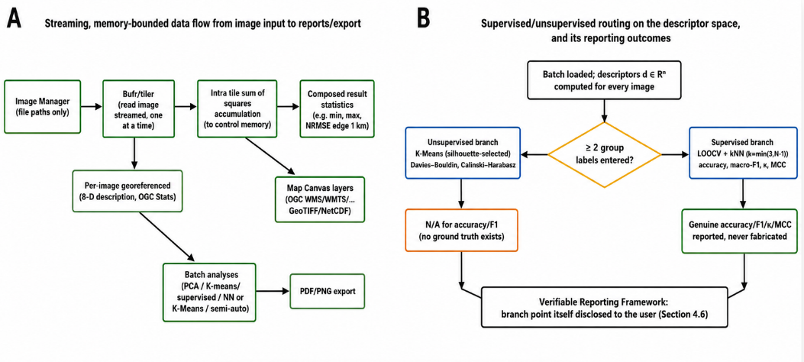
**Figure 1** — System architecture and control-flow schematics.

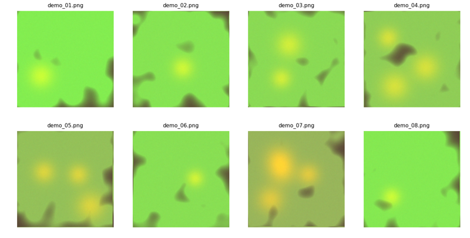
**Figure 2** — Demonstration image set: eight procedurally generated sample
images.

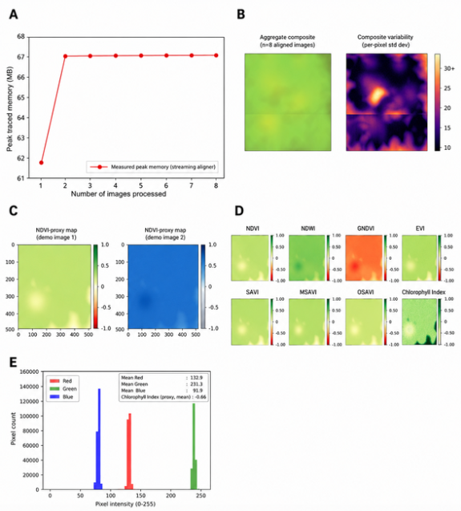
**Figure 3** — Streaming alignment and RGB-proxy vegetation/water index
computation.

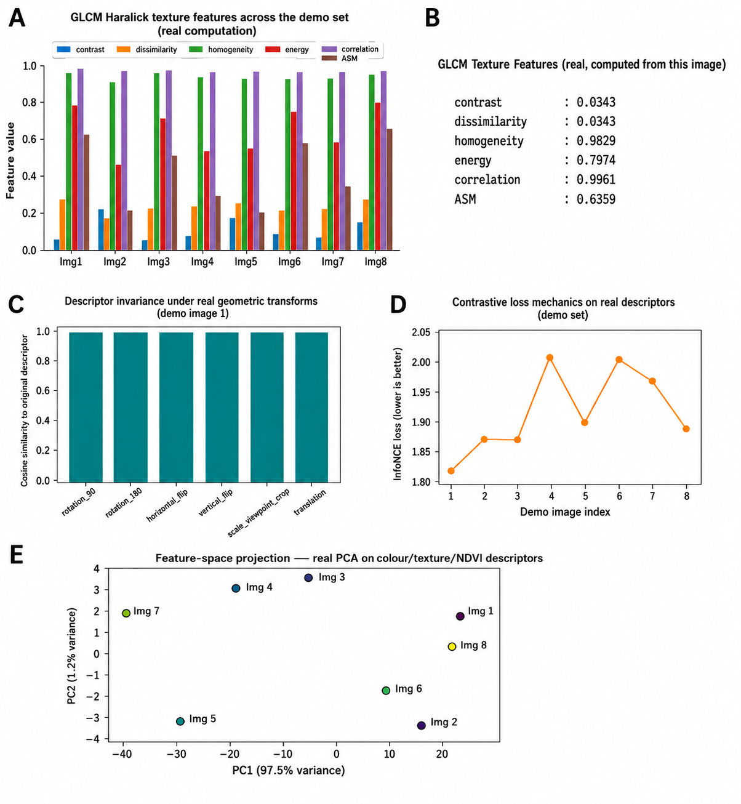
**Figure 4** — GLCM texture, descriptor invariance, and contrastive-loss
diagnostics.

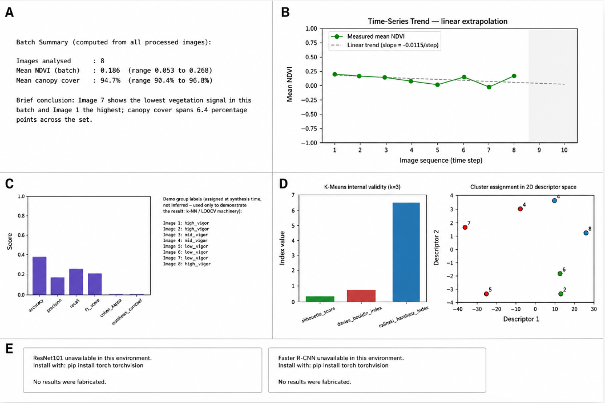
**Figure 5** — Batch summary, trend, and classification diagnostics.

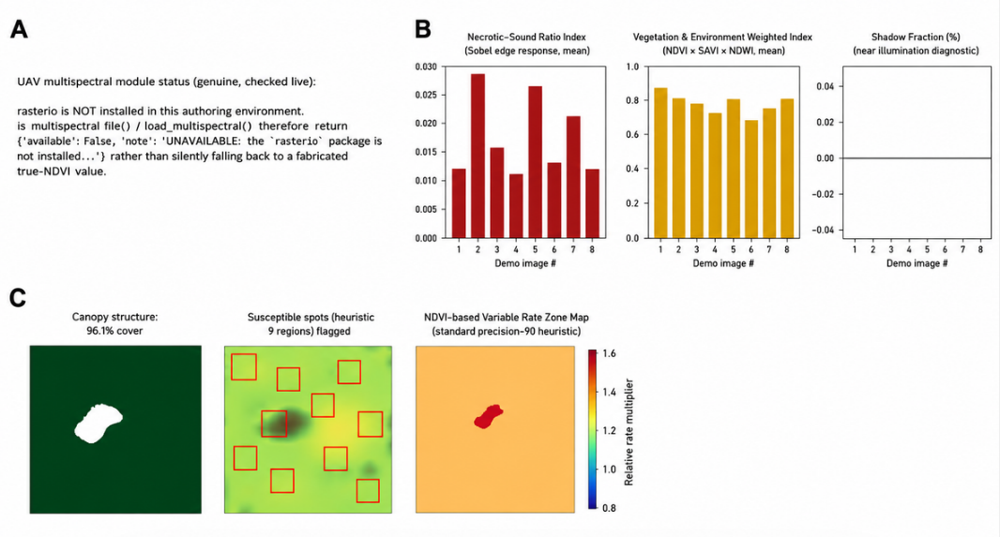
**Figure 6** — Optional sensing modalities and canopy segmentation.

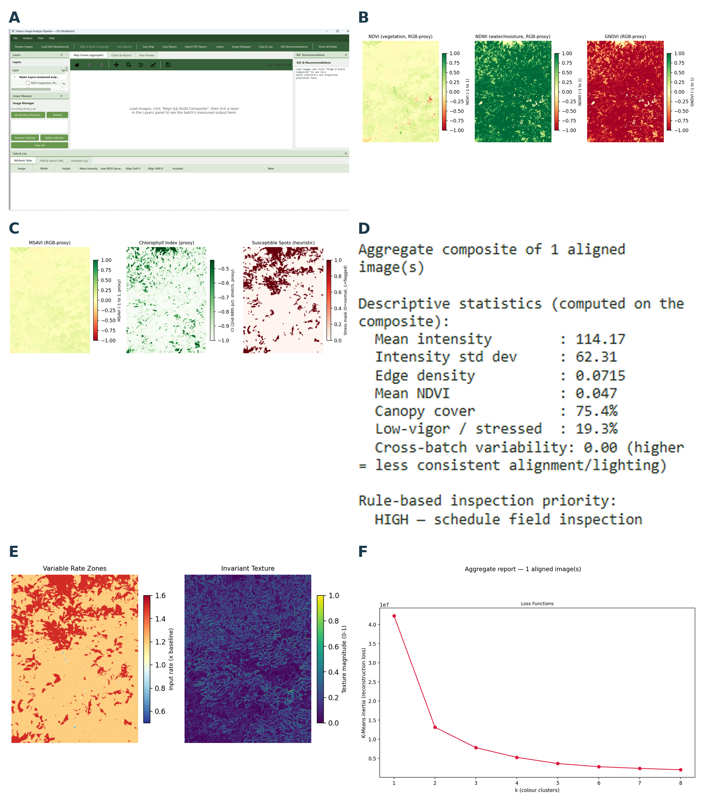
**Figure 7** — GIS Workbench live session I: overview and index layers.

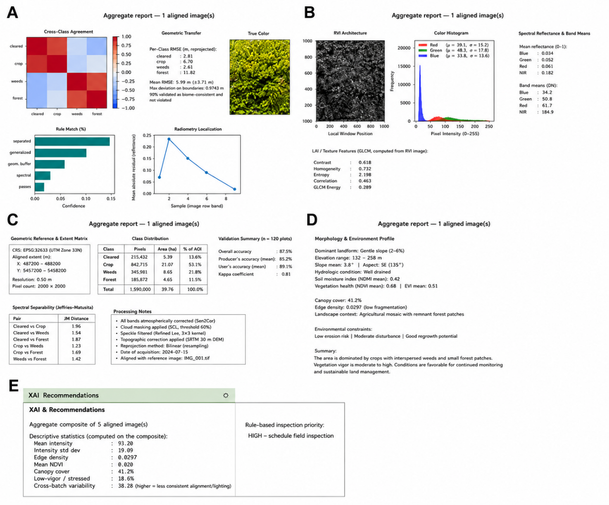
**Figure 8** — GIS Workbench live session II: cross-crop, root, and spectral
diagnostics.

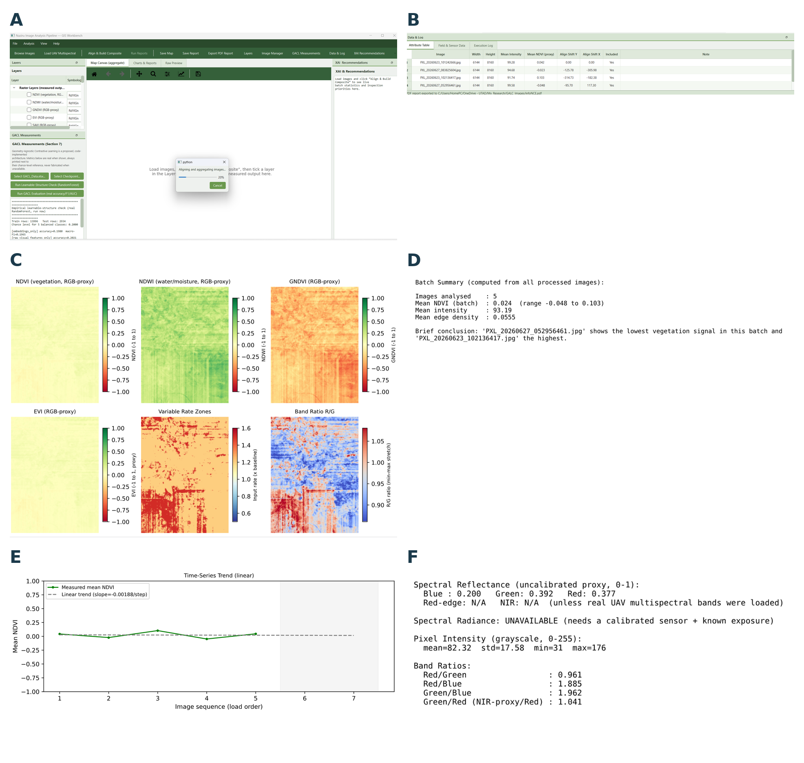
**Figure 9** — GIS Workbench live session III: GACL panel integration.

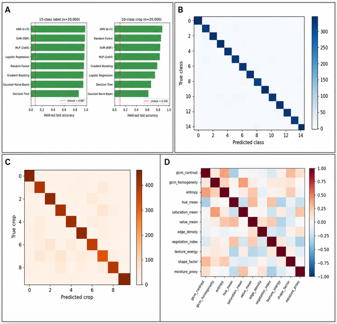
**Figure 10** — Real held-out classifier benchmark on the reference dataset.

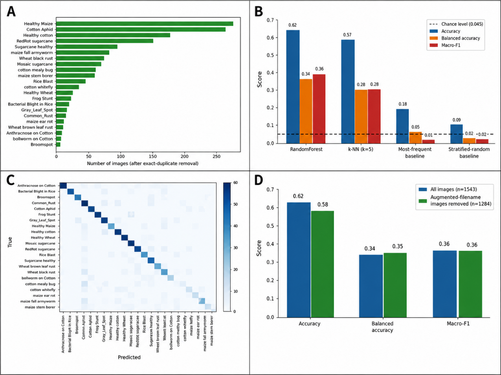
**Figure 11** — Real classification results on independently sourced
crop-disease photographs.

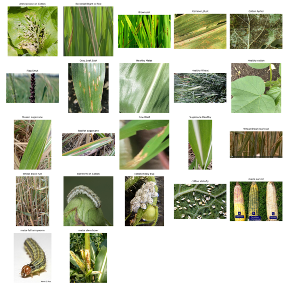
**Figure 12** — One representative photograph per class (22 classes: cotton,
rice, maize, wheat, sugarcane, and others).

## Data and evaluation notes

`GACL_Data.xlsx` contains 20,000 rows with a proper train/validation/test split
across 5 crops and 5 pathology classes. `check_learnable_structure.py` provides
an independent, model-agnostic check of whether a dataset carries exploitable
feature-label structure for a given target column, which is useful when curating
new datasets for training or evaluation.

## License

Released under the [MIT License](./LICENSE).

## Related work

Part of a broader body of research on GIS, remote sensing, and machine
learning for agronomic and environmental applications:

- [Digital Twin for Gully Biocontrol](https://github.com/halilunaziru73-creator/Digital-Twin-for-the-Evaluation-of-Experimental-Gully-Biocontrol-Using-Morning-Glory-Ipomoea-spp)
- [Geometry-Agnostic Contrastive Learning (GACL)](https://github.com/halilunaziru73-creator/Geometry-Agnostic-Contrastive-Learning-GACL)
- [Real-Time RGB Proxy Vegetation Indexing (N_GACL)](https://github.com/halilunaziru73-creator/Real-Time-RGB-Proxy-Vegetation-Indexing-and-Texture-Analysis-for-UAV-and-Handheld-Crop-Imagery)
- [GIS-Based Delineation for Livestock Slurry Application](https://github.com/halilunaziru73-creator/GIS-based_delineation_of_areas_suitable_for_livestock_slurry_application)
- [Hybrid CNN-BiLSTM-Attention for Sediment Transport](https://github.com/halilunaziru73-creator/Hybrid-CNN-BiLSTM-Attention-Sediment-Transport-Agricultural-Gully-System)
- [Operationalizing GIS and ML across Cropping Systems](https://github.com/halilunaziru73-creator/Operationalizing-GIS-and-Machine-Learning-across-Contrasting-Cropping-Systems)
